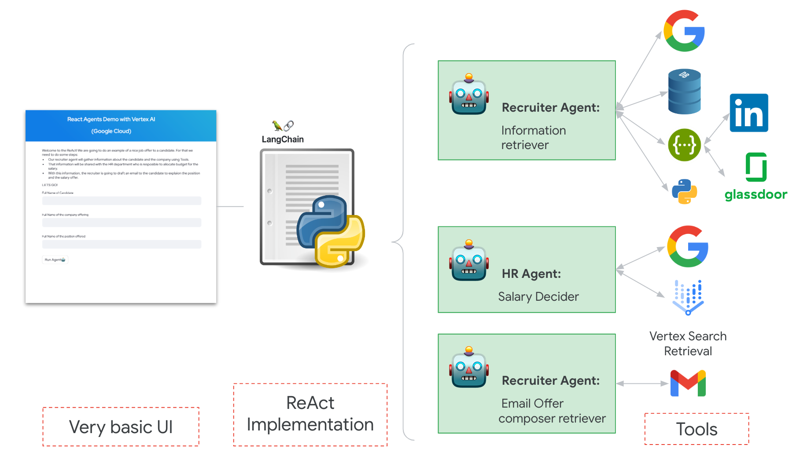

# React Agents Demo with Vertex AI (Google Cloud)

Note: This repo is not inteded for production use. It is meant to be used to demo the ReAct pattern with customers and find use cases with them. 

[ReAct](https://react-lm.github.io/) is an intiutive pattern to perform actions using natural language. This demo allows us to showcase a use case of a Recruiter Agent and a HR Agent interacting between each other to send and offer to a candidate.

The demo uses the following tools to fulfill it's mission:
- A database to find information about the candidate.
- Google Search to find information.
- LinkedIn to find the candidate's information.
- Gmail to generate de draft.
- Other tools to find suitable dates for interviews.

The demo is based in the awesome work by [Eden Marco](https://github.com/g-emarco) in [this repo](https://github.com/g-emarco/llm-agnets).

We use the awesome tool Langchain in this demo. If you don't know about it, you can find a nice video [here](https://www.youtube.com/watch?v=kYRB-vJFy38)

## Installation

1. Generate a `.env` file with the following information:
    - SERPAPI_API_KEY=`<API Key for Google Search>` 
    - PROXYCURL_API_KEY=`<API Key for LinkedIn Search>` 
    - SQL_DATABASE_URI=`sqlite:///db/mytest.db`
    - X_RAPIDAPI_KEY=`<API Key for Glassdoor Salary information>`
    - USER_FULLNAME=`<The candidate's name>`
    - JOB_POSITION=`<The Job position we are offering>`
    - COMPANY_NAME=`<A real company name>`
    - TESTING=`True` <-- this is to avoid calling Google Search and run out of credits. If you want a REAL demo, use False and pay for the API :)
    - LLM_TYPE="vertexai"
    - VERTEX_MODEL="text-bison"
    - PROJECT_ID=`<ID of your GCP Project>`
    - LOCATION_ID="global"
    - DATA_STORE_ID=`<ID of your Datastore>`

    Some (or most) of the tools require registration. Here you can find information about the tools:
    - Find more information about Serpapi [here](https://serpapi.com/)
    - Find more information about ProxyCurl [here](https://nubela.co/proxycurl/)
    - Find more information about RapidAPI [here](https://rapidapi.com/hub)
    - Find more information about how to create a Vertex Search datastore [here](https://cloud.google.com/generative-ai-app-builder/docs/try-enterprise-search). Upload a sample PDF with some fake feedback from an interview. You can find an example in the utils folder.

2. Generate a `credentials.json` file in the root folder. To do this, follow [these](https://developers.google.com/workspace/guides/create-credentials) steps.
3. Install dependencies in the `requirements.txt`file using the following command:
    `pip install -r requirements.txt`
4. Enable the `Vertex AI APIs`. Click [this link](https://console.cloud.google.com/flows/enableapi?apiid=aiplatform.googleapis.com&_ga=2.183293856.707738149.1700668049-1789233788.1700133640&_gac=1.258834040.1700648608.Cj0KCQiA6vaqBhCbARIsACF9M6kWo-jRmFyoZcXyWAvgIz_GP4p8eWz7svb_u1GIdAphPhQHa8Kviq4aAlOwEALw_wcB).
5. Run the faker script to create the rows in the database:

        python utils/faker_db.py

### Recommendations:

API calls requires money. I would encourage you to generate json files with the responses you usually get from these APIs and locate them inside the utils folder. One way to do it is to call the API manually and save the result in both `job_salary.json` and `linkedin_profile.json` files. The demo is design to read these if there is an error.

In addition, I have included a couple of fake responses for companies and salary searches in Google. It is within the file `search_response.json`.

## Execution

The demo will mimic this behaviour:

1. Our recruiter agent will gather information about the candidate and the company using Tools. 
2. That information will be shared with the HR department who is resposible to allocate budget for the salary.
3. With this information, the recruiter is going to draft an email to the candidate to explaion the position and the salary offer.

To run from the graphical interface run the following command:

    streamlit run web/app.py

To run it from the shell, use the following command:

    python shell_execution.py

Check your email (once you enabled the app to interact with the agent) drafts to see the [draft](https://mail.google.com/mail/u/1/#drafts).

Note: You need to use a gmail account to perform this operation.

### Recommendations:

To explain the ReAct pattern, you can use the `example_agent.py` file to see the results using wikipedia. 

More information about lanchain and react [here](https://python.langchain.com/docs/modules/agents/agent_types/react)

